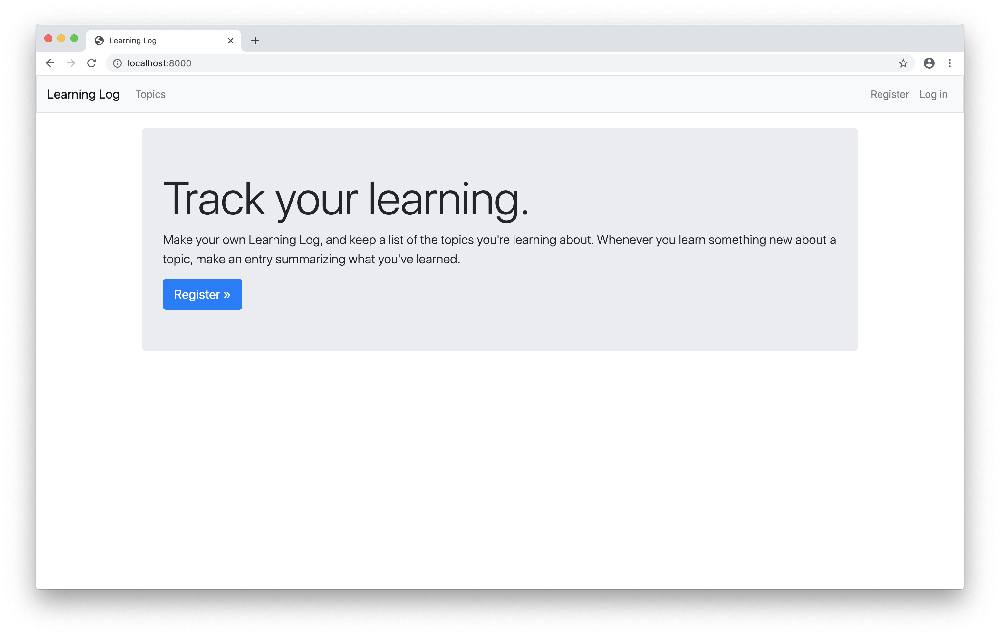
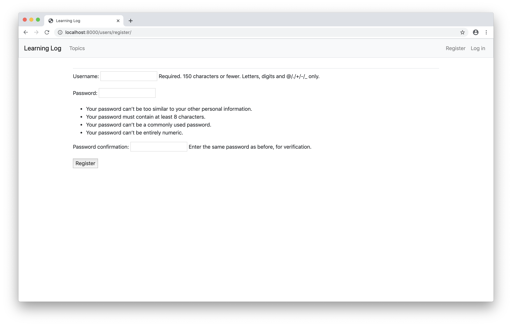
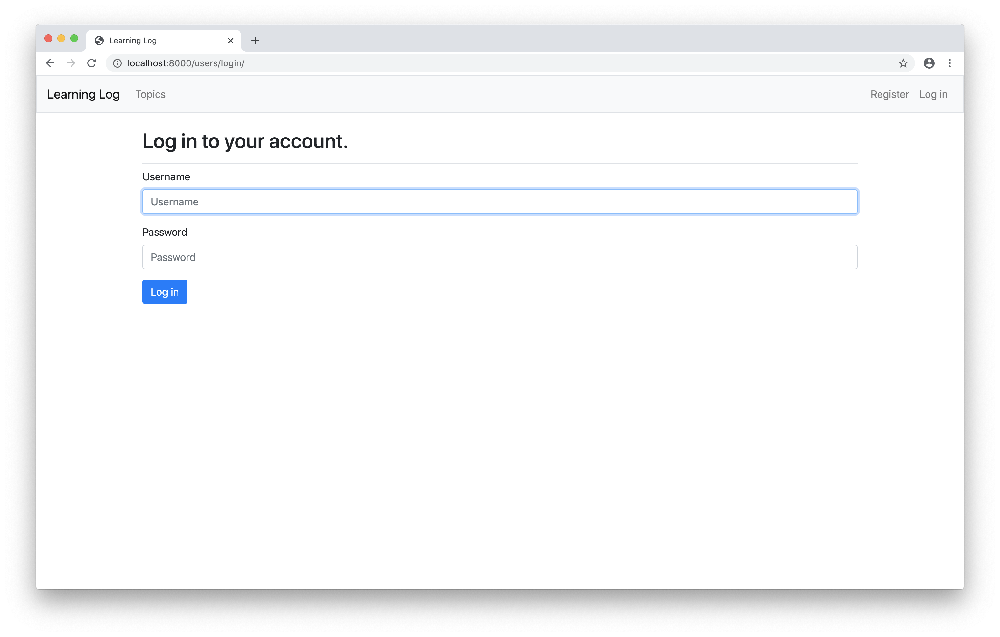
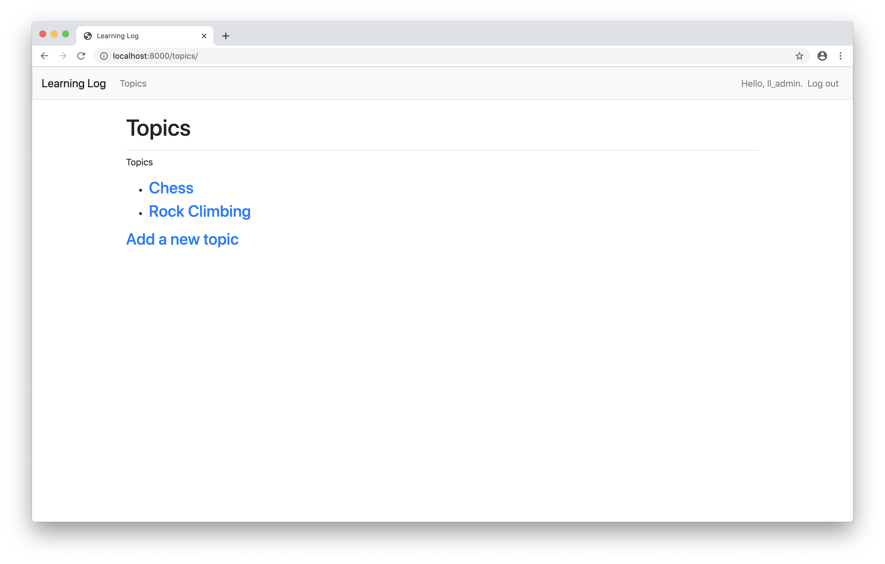
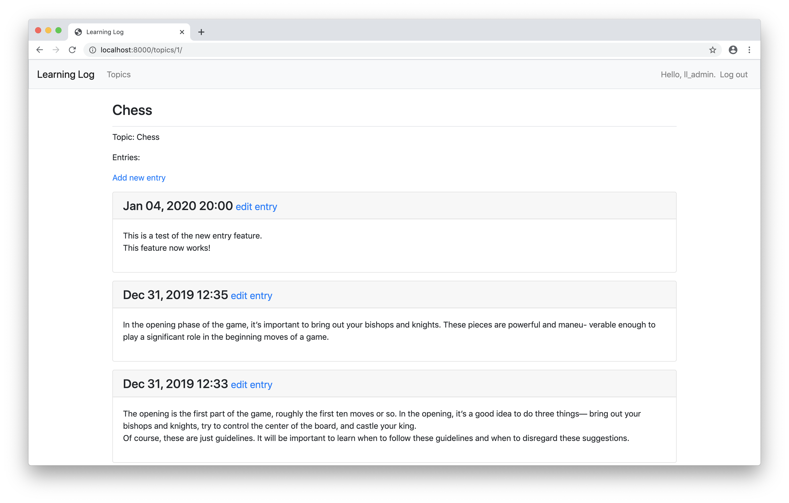

# learning-log

Learning Log is available on Heroku at: <https://learing-log-fredlavoie.herokuapp.com/>

Learning log is a full stack web application built using the the [Python](https://www.python.org) framework [Django](https://www.djangoproject.com/). The database used to store the data is [SQLite](https://sqlite.org/index.html).

## Screenshots

### Homepage

### Registration

### Login

### Topics

### Entries

## Dependencies

These are the modules needed to run Learning Log:

- [python3](https://www.python.org)
- [Django](https://www.djangoproject.com/)
- [SQLite](https://sqlite.org/index.html)
- [django-bootstrap4](https://django-bootstrap4.readthedocs.io/en/latest/)
